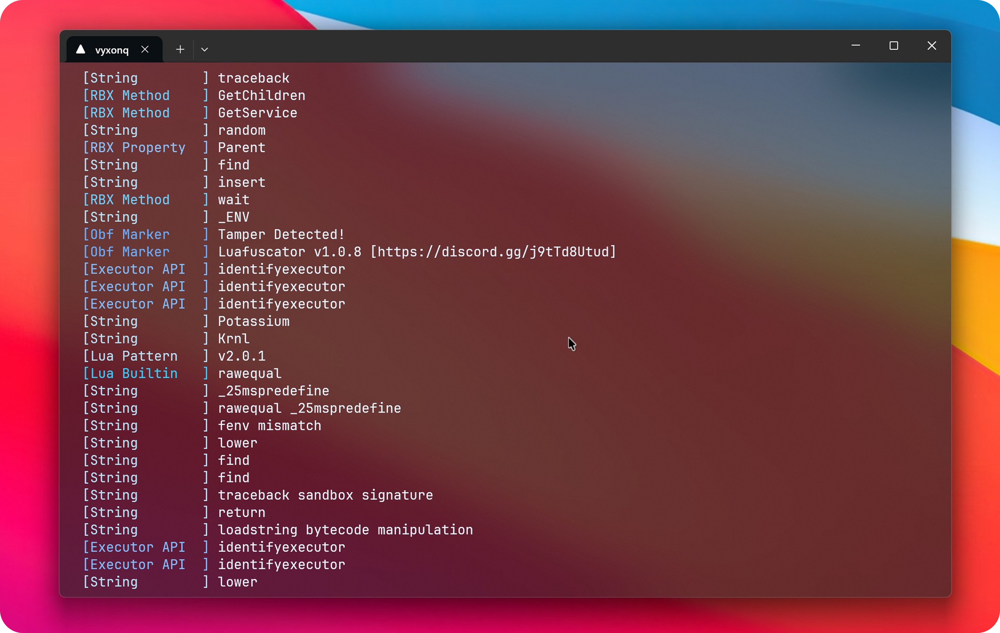

# Luafuscator Deobfuscator

**Deobfuscator for Luafuscator 1.0.8+ (BETA)**

<p align="center">
  
</p>

## ✨ Features

- Full support for **Luafuscator 1.0.8+**
- Advanced **Abstract Syntax Tree (AST)** processing and renaming
- **Constant folding** to simplify expressions
- **LFR (_LFR) resolution** — recovers renamed functions
- Multiple analysis modes (`--verbose`, `--analyze`, etc.)

## 🚀 Usage

### Basic command:
```bash
1.0.8.0-D.exe "obfuscated.lua"
```

### Recommended (with detailed output):
```bash
1.0.8.0-D.exe input.lua --verbose
```

Output is automatically saved as **`deobfuscated.lua`** in the same folder.

### Available Options

| Option          | Shortcut | Description                                      |
|-----------------|----------|--------------------------------------------------|
| `--verbose`     | `-v`     | Show detailed processing information             |
| `--analyze`     | `-a`     | Show analysis and executor warnings              |
| `--quiet`       | `-q`     | Suppress string output                           |
| `--printable`   | `-p`     | Show only printable strings                      |
| `--no-lfr`      |          | Skip `_LFR` resolution                           |
| `--no-fold`     |          | Skip constant folding                            |
| `--no-ast`      |          | Skip AST renaming pass                           |

---

## 🛠️ Building from Source

1. Open the solution in **Visual Studio**
2. Set configuration to **Release**
3. Set platform to **Any CPU** (recommended) or **x64**
4. Make sure the target framework is **.NET 8.0** (or .NET 10.0)
5. Build the project

The executable will be located at:
- `.NET 8.0`: `bin\Release\net8.0\1.0.8.0-D.exe`
- `.NET 10.0`: `bin\Release\net10.0\1.0.8.0-D.exe`

---

## ⚠️ Disclaimer

This tool is provided for **educational and reverse-engineering/analysis purposes only**.  
Always carefully review the deobfuscated code before executing it.

---

## 📬 Contact & Support

**Created and maintained by [vyxonq](https://github.com/vyxonq-dev)**

- Discord: `1227908670394863639`

Feel free to open an issue if you encounter any bugs or have feature requests.

---

## License

This project is licensed under the **MIT License**.
